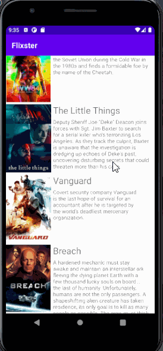
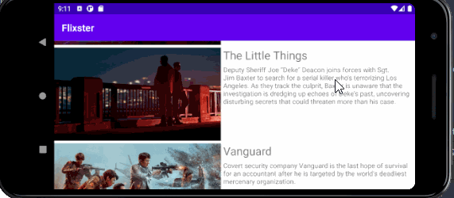

# Flixster
Flixster is an app that allows users to browse movies from the [The Movie Database API](http://docs.themoviedb.apiary.io/#).

## Flixster Part 2

### User Stories

#### REQUIRED (10pts)

- [x] (8pts) Expose details of movie (ratings using RatingBar, popularity, and synopsis) in a separate activity.
- [x] (2pts) Allow video posts to be played in full-screen using the YouTubePlayerView.

#### BONUS

- [x] Implement a shared element transition when user clicks into the details of a movie (1 point).
- [ ] Trailers for popular movies are played automatically when the movie is selected (1 point).
  - [ ] When clicking on a popular movie (i.e. a movie voted for more than 5 stars) the video should be played immediately.
  - [ ] Less popular videos rely on the detailed page should show an image preview that can initiate playing a YouTube video.
- [ ] Add a play icon overlay to popular movies to indicate that the movie can be played (1 point).
- [ ] Apply data binding for views to help remove boilerplate code. (1 point)
- [ ] Add a rounded corners for the images using the Glide transformations. (1 point)

### App Walkthough GIF

 

### Notes:
The required stories were relatively easy and simple to complete. Where most of my time went however, was attempting to include the stretch stories and other features myself. This was much more difficult to do as I often had to do extra research to understand how a structure or class works, in addition to the provided CodePAth guides. I also personally found the stretch stories this unit to be a bit contradicting. One story asks for popular movies to be automatically played, yet another story asks for popular movies to have a play button icon so the user may play the video themself. I personally included the play button icon for all movies, as I'd think the absence of the button at all would degrade user experience. 

As I further explored Unit 2's topics and guides, I did find the YouTube video guides inconsistent with the online individual ones. For example, following the YouTube guide, I had originally implemented YoutubePlayerViews in the same activity as the DetailsActivity, and would load the trailers there. However, once I read the actual CodePath guide, it instructed to create a new Activity class called MovieTrailerActivity and link the two activities together. It was confusing because I then had to figure out how everything was incoporated together, and I didn't want to do something in a way that wasn't intended. 

## Flixster Part 1

### User Stories

#### REQUIRED (10pts)
- [x] (10pts) User can view a list of movies (title, poster image, and overview) currently playing in theaters from the Movie Database API.

#### BONUS
- [x] (2pts) Views should be responsive for both landscape/portrait mode.
   - [x] (1pt) In portrait mode, the poster image, title, and movie overview is shown.
   - [x] (1pt) In landscape mode, the rotated alternate layout should use the backdrop image instead and show the title and movie overview to the right of it.

- [ ] (2pts) Display a nice default [placeholder graphic](https://guides.codepath.org/android/Displaying-Images-with-the-Glide-Library#advanced-usage) for each image during loading
- [ ] (2pts) Improved the user interface by experimenting with styling and coloring.
- [ ] (2pts) For popular movies (i.e. a movie voted for more than 5 stars), the full backdrop image is displayed. Otherwise, a poster image, the movie title, and overview is listed. Use Heterogenous RecyclerViews and use different ViewHolder layout files for popular movies and less popular ones.

### App Walkthough GIF
#### Portrait Mode:
  
#### Landscape Mode:
 

### Notes
No particular challenges with the creation of the app itself, though personally, my computer had problems handling AndroidStudio and the emulator at once. It would often take up to 5-10 min just to start booting up, and prolong other important apps on my desktop from loading. This is where I find a good portion of my time goes while doing the project. 

### Open-source libraries used

- [Android Async HTTP](https://github.com/codepath/CPAsyncHttpClient) - Simple asynchronous HTTP requests with JSON parsing
- [Glide](https://github.com/bumptech/glide) - Image loading and caching library for Androids
